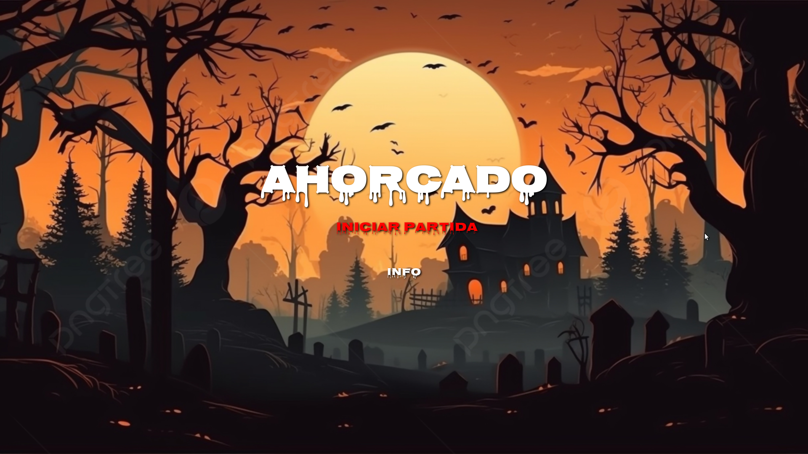

# Juego del Ahorcado

Este es el juego clásico del ahorcado implementado en html5 <i class="fab fa-html5"></i> Css <i class="fab fa-css3"></i> y JS <i class="fab fa-js"></i>.
Se puede ejecutar desde ordenador y smartphone y el juego incluye tres páginas: Inicio, Información y Juego.

## Contenido

1. [Inicio](#inicio)
2. [Información](#información)
3. [Juego](#juego)
4. [Cómo jugar](#cómo-jugar)
5. [Sonidos](#sonidos)

### Inicio

La página de inicio muestra una pantalla de bienvenida para el juego del ahorcado.

### Información

La página de Información contiene detalles sobre el juego, el desarrollador y enlaces a LinkedIn y GitHub del creador.

### Juego

La página de juego es donde puedes jugar al ahorcado. Adivina las letras y trata de evitar que el personaje sea ahorcado.

### Cómo jugar

Para jugar al juego del ahorcado, sigue estos pasos:

1. Haz clic en el botón "Obtener palabra" en la página de juego.
2. Adivina las letras haciendo clic en los botones de letras en la parte inferior de la pantalla.
3. Si adivinas correctamente, las letras se mostrarán en la palabra oculta.
4. Si te equivocas 7 veces, el personaje será ahorcado.
5. Intenta adivinar la palabra antes de que sea demasiado tarde.

## Sonidos

El juego incluye sonidos espeluznantes al comenzar, ganar o perder la partida.

---

¡Espero que disfrutes jugando al Ahorcado del Terror!

Si tienes alguna pregunta o deseas contribuir al proyecto, no dudes en ponerte en contacto con el desarrollador:

[<i class="fab fa-linkedin"></i> LinkedIn](https://www.linkedin.com/in/jes%C3%BAs-v%C3%A1zquez-mu%C3%B1oz-413685277/)
[<i class="fab fa-github"></i> GitHub](https://github.com/Vaz77)
